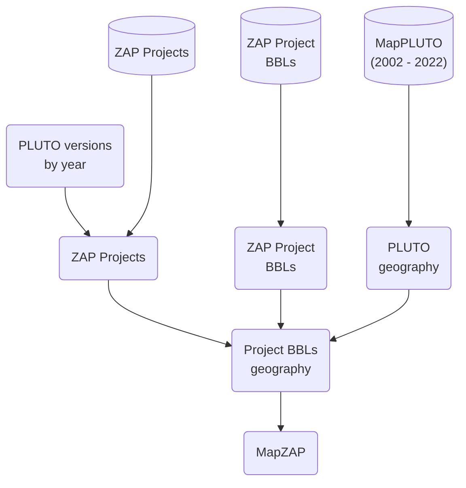

# db-zap-opendata

Workflow for creating subset of ZAP data that's on open data

## Instructions

> Note: set the environmental variables in `.env` according to `example.env`.

1. open repo in the defined dev container

2. run a ZAP Pull

    ```bash
    python -m src.runner <name of the entity>
    ```

    e.g.

    ```bash
    python -m src.runner dcp_projects
    ```

## MapZAP

MapZAP is a dataset of ZAP project records with spatial data. Based on the BBLs associated with a project when it was referred for review (Project certified referred year), a version of PLUTO from that year is chosen and used to find and aggregate BBL geometries to represent the project.
...

### Data sources

- ZAP Projects
- ZAP Project BBLs
- MapPLUTO (versions from 2002 - 2022)

### Build process

> Planning to do this via dbt

- Currently running saved queries in the BigQuery console and saving query results as tables in the `dcp_mapzap` BigQuery dataset.



### Notes

- All source data is in BigQuery
...
