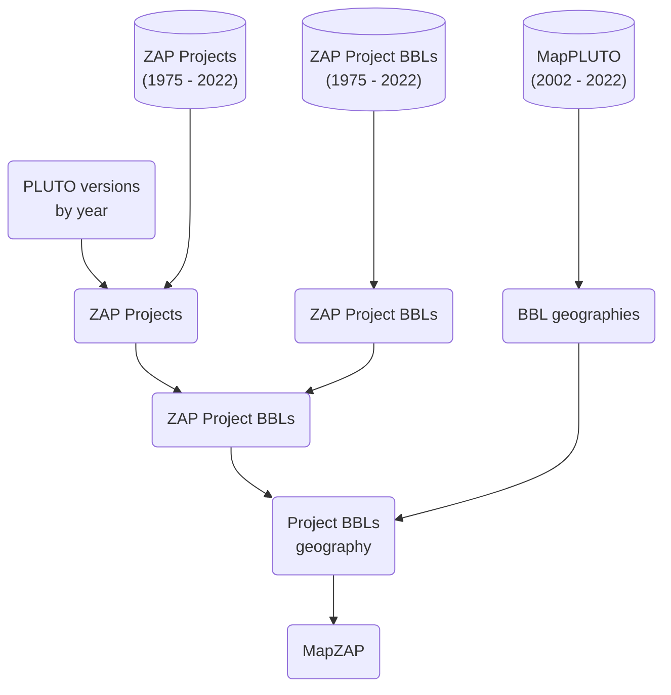

# db-zap-opendata

Workflow for creating subset of ZAP data that's on open data

## Instructions

## MapZAP

MapZAP is a dataset of ZAP project records with spatial data. Based on the BBLs associated with a project when it was referred for review (Project certified referred year), a version of PLUTO from that year is chosen and used to find and aggregate BBL geometries to represent the project.
...

### Data sources

> All source data is in BigQuery as a result of the export workflows in this repo

- ZAP Projects
- ZAP Project BBLs
- MapPLUTO (versions from 2002 - 2022)

### Output

- Fields:
  - Project Name
  - Project Certified Referred Year
  - Pluto Version
  - BBLs
  - Sum of BBL geometry areas
  - Area of Project geometry
  - Project WKT geometry (WKT)

### Build process

> Planning to do this via dbt

- Currently running saved queries in the BigQuery console and saving query results as tables in the `dcp_mapzap` BigQuery dataset.



### Notes

- All source data is in BigQuery
- For use in CEQR Type II analysis by Planning Support team:
  > For the ZAP data pull, specifically, we propose to narrow down from all records using the criteria below. Assuming you want to pull and join all ZAP BBL records so this work is useful for others, this use case will need the fields in parentheses below as columns so I can filter down the set:
  >
  > - Certified/referred date on or after 2/1/11 (certified/referred field from project entity)
  > - CEQR number contains data (CEQR number from project entity)
  > - Public status equals completed (Public Status from project entity)
  > - CEQR Type does not equal Type II (CEQR Type from project entity)
  > - Project Status does not equal Record Closed, Terminated, Terminated-Applicant Unresponsive, or Withdrawn-Other (Project -   > Status from project entity)
  > - Applicant Type does not equal DCP (Applicant Type from project entity)
  > - BBL is not located within a Special Coastal Risk District
  > - For all projects with a rezoning action, was it a rezoning from an M district to an R district? (Will filter out those > where - the answer is yes)
  > - Existing zoning district(s)
  > - Proposed zoning district(s)
  >
  > Additionally, the data pull I’ve been using pulls data into the following columns for later use:
  >
  > - Project ID
  > - Project Name
  > - Lead Division
  > - Actions
  > - Project Status
  > - BBL
  > - CEQR Type
  > - WRP Review Required
  > - FEMA Flood Zone V
  >
  > Lastly, would it be possible to auto calculate these two into the records? If not, we can do it later.
  >
  > - Number of unique blocks per project
  > - For projects with a rezoning action, sum the total rezoned area

- Mapping CPC project to Housing DOB Job Numbers
  - Concerned that a ZAP project may not have all relevant BBls to match to 
  - Rezoning shapefiles may have better (larger) than constructed
    - should we default to rezoning shapefile? a real project may have multiple action. the rezoning geometry may only be a subset
    - this is only usable when a project has a rezoning
    - there are many more projects than this shapefile represents
    - hopefully Project ID is in the shapefile
  - we have a small list of 
  - SE overlaid Housing DB point file with MapZAP
    - some points were outside of the BBL-based 

...

## Dev

> Note: set the environmental variables in `.env` according to `example.env`.

### Run an export script

1. open repo in the defined dev container

2. run a ZAP Pull

    ```bash
    python -m src.runner <name of the entity>
    ```

    e.g.

    ```bash
    python -m src.runner dcp_projects
    ```

### Run dbt

```bash
dbt deps
dbt debug
dbt seed --full-refresh
dbt run
dbt test
```

...

### Develop dbt

Run pre commit checks for model and config file:
```bash
pre-commit run --all-files
```
> This is configured by `.pre-commit-config.yaml`

Run a single model:
```bash
dbt run --select int_zap_project_bbls
```

Run a single model and it's parent models:
```bash
dbt run --select +int_zap_project_bbls
```

Generate a model based on a schema YAML file
```bash
dbt run-operation generate_base_model --args '{"source_name": "zap_projects", "table_name": "20230515"}'
```
Generate a schema YAML file based on a model

```bash
dbt run-operation generate_model_yaml --args '{"model_names": ["stg_dcp__zap_project_bbls"]}'
```
