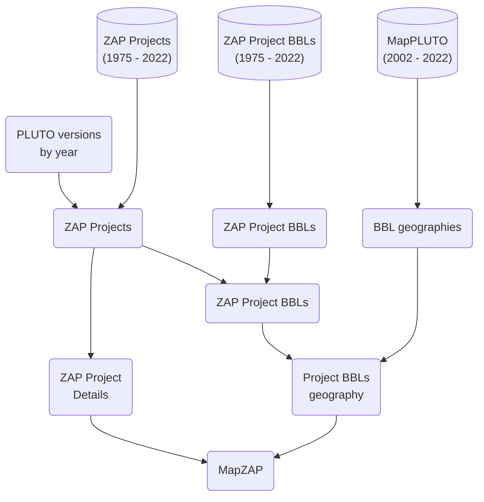

# db-zap-opendata

Workflows for:

- creating subset of ZAP data that's on open data
- creating MapZAP

## Instructions

## MapZAP

MapZAP is a dataset of ZAP project records with spatial data. Based on the BBLs associated with a project when it was referred for review (Project certified referred year), a version of PLUTO from that year is chosen and used to find and aggregate BBL geometries to represent the project.
...

### Data sources

> All source data is in BigQuery as a result of the export workflows in this repo

- ZAP Projects
- ZAP Project BBLs
- MapPLUTO (versions from 2002 - 2022)

### Output

- Fields:
  - Project Name
  - Project Certified Referred Year
  - Pluto Version
  - BBLs
  - Sum of BBL geometry areas
  - Area of Project geometry
  - Project WKT geometry (WKT)

### Build process

> Planning to do this via dbt

- Currently running saved queries in the BigQuery console and saving query results as tables in the `dcp_mapzap` BigQuery dataset.



### Notes

- All source data is in BigQuery

#### Notes for in-progress work

- For use in CEQR Type II analysis by Planning Support team:
  - For the ZAP data pull, specifically, we propose to narrow down from all records using the criteria below. Assuming you want to pull and join all ZAP BBL records so this work is useful for others, this use case will need the fields in parentheses below as columns so I can filter down the set:
    - Certified/referred date on or after 2/1/11 (certified/referred field from project entity)
    - CEQR number contains data (CEQR number from project entity)
    - CEQR Type does not equal Type II (CEQR Type from project entity)
    - Public status equals completed (Public Status from project entity)
    - Project Status does not equal Record Closed, Terminated, Terminated-Applicant Unresponsive, or Withdrawn-Other (Project - Status from project entity)
    - BBL is not located within a Special Coastal Risk District
    - Existing zoning district(s)
    - Proposed zoning district(s)\
    - [below this, I'm confused]
    - For all projects with a rezoning action, was it a rezoning from an M district to an R district? (Will filter out those  where - the answer is yes)
    - Applicant Type does not equal DCP (Applicant Type from project entity)
  - Additionally, the data pull I’ve been using pulls data into the following columns for later use:
    - Project ID
    - Project Name
    - Lead Division
    - Actions
    - Project Status
    - BBL
    - CEQR Type
    - WRP Review Required
    - FEMA Flood Zone V
  - Lastly, would it be possible to auto calculate these two into the records? If not, we can do it later.
    - Number of unique blocks per project
    - For projects with a rezoning action, sum the total rezoned area

- Mapping CPC project to Housing DOB Job Numbers
  - Concerned that a ZAP project may not have all relevant BBls to match to
  - Rezoning shapefiles may have better (larger) than constructed
    - should we default to rezoning shapefile? a real project may have multiple action. the rezoning geometry may only be a subset
    - this is only usable when a project has a rezoning
    - there are many more projects than this shapefile represents
    - hopefully Project ID is in the shapefile
  - we have a small list of
  - SE overlaid Housing DB point file with MapZAP
    - some points were outside of the BBL-based

- DCP Zoning Map Amendments data
  - You many want to filter status for adopted or "adopted or certified". All domain values listed below
    - 1 - adopted
    - 2- certified
    - 3 - withdrawn
    - 4 - Not yet certified
    - 5- disapproved
    - 6- terminated
  - Here are the domain values for Applicant type:
    - 0-other
    - 1-DCP
    - 2-Private
    - 3-DCP and Other City Agency
    - 4-Other City Agency
    - 5-Borough President
  - For Joining by ULURP number use either TRACKINGNO or ULURPNO fields. You should strip the prefix letter (usually a N or C) from the zap data since this dataset does not use them.
  - Some info on ULURP numbers, one letter prefix, followed by 6 digit number, followed by 3 letter suffix.
  - The first two digits of the ULURP number are the last two Year numbers of the year the application was filed (030276zmk - means application was filed on 2003).
  - The three letter suffix is the application type followed by borough (zmk - means zm =zoning map amendment, k = brooklyn) The boro letter codes for ULURP are K-BK, M-MN, Q-QN, R-SI, X-BX, Y-citywide.
  - If a suffix has four letters it means the application was re-filed for a modification so if the example above was modified the new ULURP number would be 030276azmk, if modified again 030276bzmk, and so on

...

## Dev

> Note: set the environmental variables in `.env` according to `example.env`.

### Run an export script

1. open repo in the defined dev container

2. run a ZAP Pull

    ```bash
    python -m src.runner <name of the entity>
    ```

    e.g.

    ```bash
    python -m src.runner dcp_projects
    ```

### Run dbt

Setup

```bash
dbt deps
dbt debug
```

Building tables

```bash
dbt seed --full-refresh
dbt run
dbt test
```

Building docs

```bash
dbt docs generate
dbt docs serve
```

### Develop dbt

Run pre commit checks for model and config file:
> This is configured by `.pre-commit-config.yaml` and some checks depend on having already run dbt compile or dbt run

```bash
pre-commit run --all-files
```

Run a single model:

```bash
dbt run --select int_zap_project_bbls
```

Run a single model and it's parent models:

```bash
dbt run --select +int_zap_project_bbls
```

Generate a model based on a schema YAML file

```bash
dbt run-operation generate_base_model --args '{"source_name": "zap_projects", "table_name": "20230515"}'
```

Generate a schema YAML file based on a model

```bash
dbt run-operation generate_model_yaml --args '{"model_names": ["stg_dcp__zap_project_bbls"]}'
```
